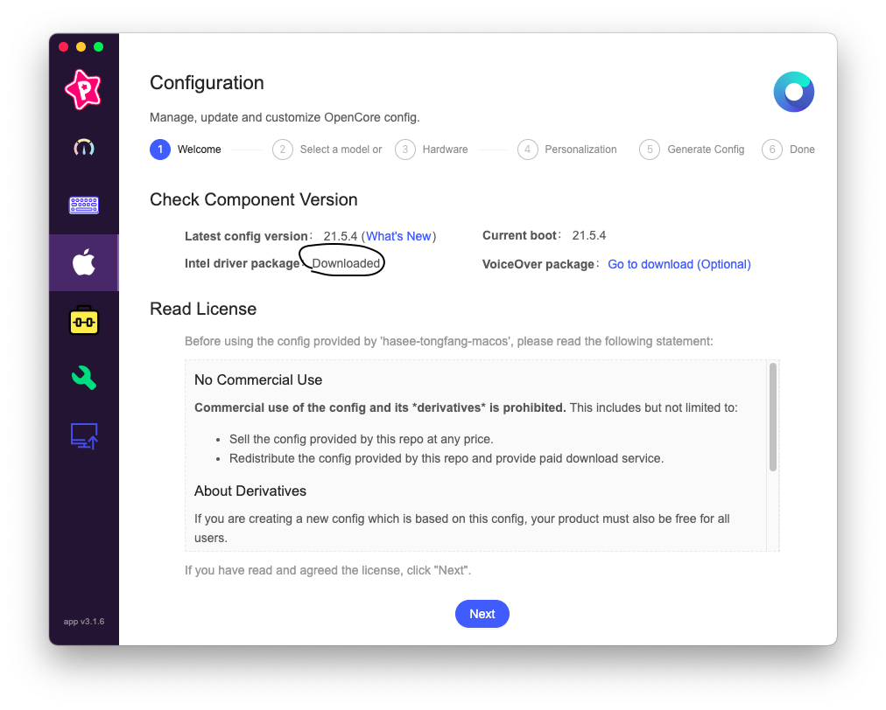

**MONSTER Abra A5 V15.2 İntel i7 9.Nesil**

  

[kirainmoe](https://github.com/kirainmoe) tarafından hazırlanan paket baz alınarak kurulmuştur.

**Mac OS Versiyonu: Big Sur 11.3.1**
**OpenCore Versiyonu: 0.6.9**

 - Farklı modeldeki Monster cihazlarınız için [**bu**](https://osxinfo.net/konu/monster-cihazlar-icin-efi-kurulum-paketleri-8-9-nesil.20019/) linkteki rehberi uygulayarak kendi efi paketinizi hazırlayabilirsiniz. 
 - 10.nesil notebooklar henüz **desteklenmemektedir**.
 - Şuanki sistemde ****dual boot**(Windows 10 + Big Sur)** kullanılmaktadır.
 -  **Triple boot(Windows 10 + Mac Os + Linux)** kullanmak isteyen kullanıcılar [bu linkteki](https://osxinfo.net/konu/basarili-kurulum-triple-boot-monster-abra-a5-v15-2-opencore-0-6-6.21838/#post-158054) konuyu takip ederek kurulum gerçekleştirebilirsiniz.
 
## Sistem
 - Intel® Coffee Lake Core™ i7-9750H 6C/12T; 12MB L3; 8GT/s; 2.6GHz > 4.5GHz; 45W; 14nm
 - Intel® HM370 Chipset
 - 16GB (2x8GB) DDR4L 1.2V 2666MHz SODIMM 
 - Nvidia GTX 1650 4096 MB & İntel UHD Graphics 630 2048 MB
 - Intel® Dual Band Wireless-AC 9560, 2x2 AC + Bluetooth 5.0 M.2 2230 (1,73 Gbps)
 - Western Digital 500 GB Black SN750 WDS500G3X0C M.2 PCI-Express 3.0 SSD
 - Samsung MZNLN256HAJQ M.2 SSD
 -  Western Digital 1 TB Blue WD10SPZX-24Z10T0 HDD
 - Realtek ALC 269 Sound
 - Bios N.1.05

## Desteklenmeyen Donanımlar

> Harici ekran kartı (Nvidia GTX 1650) [Type-c to hdmi adaptörü ile ikinci monitörden görüntü alabilirsiniz]

> Dahili wifi (Heliport uygulaması ile wifi etkinleştirebilirsiniz)

## Uyumluluk

 - En iyi performans ve uyumluluk için **Big Sur** kurmanızı öneriyorum.
## Efi Paketi Hazırlama
İlk olarak [tongfang hackintosh utility](https://github.com/kirainmoe/tongfang-hackintosh-utility/releases) uygulamasını indirin.Ardından elma simgesine tıklayarak işaret edilen yerden intel için driver indirin.
 

Cihazımızın seri numarasını seçiyoruz.Bu cihaz için GK5CP6V/GK5CP5V seri numarası kullanılacaktır.Farklı modeli cihazınız varsa cihazın alt kapağına bakıp kendi seri numaranızı bulabilirsiniz

Resimdeki gibi işaretliyoruz.

Cihazınıza göre bir macbook seri numarası üretildi.Next diyerek devam ediyoruz.

Get the last config tuşuna basarak efi paketimizi indirelim.EFI klasörü masaüstünde oluşacaktır.

## Kurulum Diski Hazırlama
 - [osxinfo.net](https://osxinfo.net/konu/macos-big-sur-intel-ve-amd-kurulum-imaji.17852/) adresinden kurulum imajını indiriyoruz.
 - Yazma aracı olarak [Etcher](https://www.balena.io/etcher/) uygulamasını indirelim.
 - İmajı indirdikten sonra arşivden çıkartalım.
 - Etcher uygulaması ile imajı ve sonrasında usb diskimizi(en az 16 gb) seçtikten sonra flash seçeneğini seçerek imajı yazdıralım.
 - Yazma işlemi tamamlandıktan sonra usb diskimizi bir kez çıkartıp tekrar takalım.
 - Diskin içinde osxinfo bölümünü açalım.
 - Diskin içindeki EFI klasörünü silip masaüstündeki EFİ klasörümüzü atıyoruz.
 - Diskimiz hazırlanmış oldu!
  
  ## Kurulumdan önce!

 - Bios ayarlarına girip aşağıdaki seçenekleri devre dışı bırakınız:
 - Secure boot:Disable
 - İntel Virtualization Technology:Disable
 
 ## **Kurulum**
 

 - Kurulum için [Özer Dönmez](https://www.youtube.com/channel/UC9QJ7AdFc1jvdrs32Y5ze0w/videos) hocamın kanalındaki rehberleri uygulayarak sağlıklı kurulum yapabilirsiniz.
 ## Kapanış

 - Teşekkürler [kirainmoe](https://github.com/kirainmoe) ve [osxinfo.net](osxinfo.net) ailesi...

 
